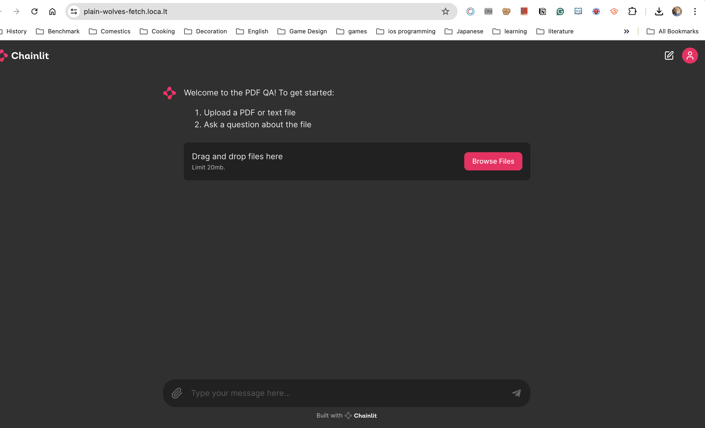
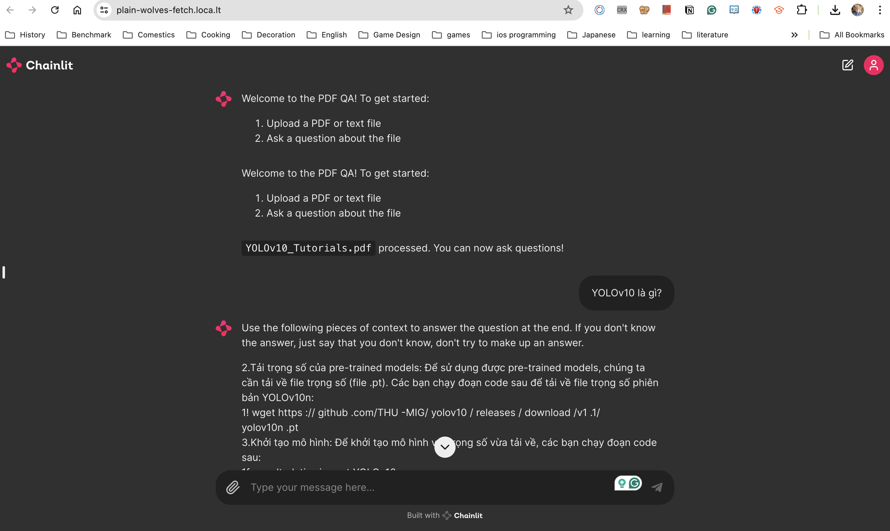
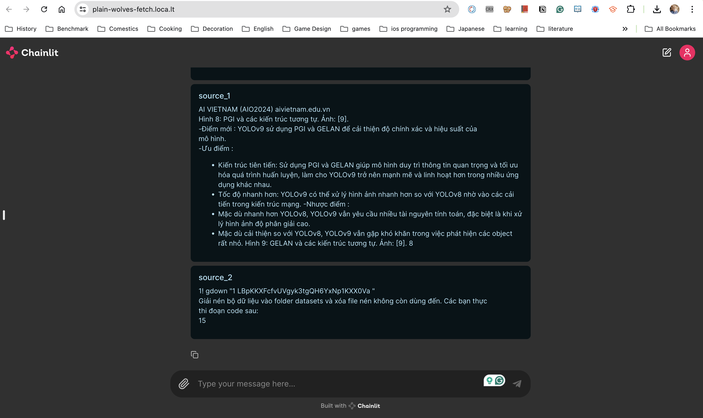

# Ứng dụng Chat RAG với PDF files sử dụng Chainlit

Ứng dụng này cho phép người dùng tải lên các tệp PDF và trò chuyện với hệ thống để nhận thông tin từ các tệp PDF đó. Ứng dụng sử dụng Chainlit để xây dựng giao diện hội thoại và thực hiện các chức năng truy vấn và trả lời từ các tài liệu PDF.

## Mục Lục

1. [Giới thiệu](#giới-thiệu)
2. [Yêu cầu](#yêu-cầu)
3. [Cài đặt](#cài-đặt)
4. [Chạy ứng dụng](#chạy-ứng-dụng)
5. [Sử dụng ứng dụng](#sử-dụng-ứng-dụng)
6. [Tài liệu tham khảo](#tài-liệu-tham-khảo)

## Giới thiệu

Ứng dụng này cho phép bạn tương tác với các tài liệu PDF thông qua giao diện chat. Bạn có thể đặt câu hỏi liên quan đến nội dung của các tệp PDF đã tải lên và nhận được câu trả lời chính xác từ hệ thống.

## Yêu cầu

Để chạy ứng dụng này, bạn cần cài đặt các thư viện và công cụ sau:

- Python 3.8 trở lên
- Chainlit
- Langchain ...
- Transformer
- Pytest & Coverage 
- ...

Model: ```lmsys/vicuna-7b-v1.5```

## Cài đặt

1. **Clone kho mã nguồn từ GitHub:**

    ```bash
    git clone https://github.com/AIO-441-nguyen-thi-kim-tuyen/chainlit-rag-chat-with-pdf.git
    cd chainlit-rag-chat-with-pdf
    ```

2. **Tạo môi trường ảo (khuyến khích):**

    ```bash
    python -m venv venv
    source venv/bin/activate  # Trên Unix hoặc MacOS
    .\venv\Scripts\activate   # Trên Windows
    ```

3. **Cài đặt các thư viện cần thiết:**

    ```bash
    pip install -r requirements.txt
    ```
   Cấu hình ```export HNSWLIB_NO_NATIVE=1``` để cài đặt ```langchain-chroma``` khi gặp lỗi
   ```
   ERROR: Failed building wheel for chroma-hnswlib 
   ```

## Chạy ứng dụng

1. **Khởi động ứng dụng Chainlit:**

    ```bash
    chainlit run app.py
    ```
    Ứng dụng sẽ tự động mở trong trình duyệt web mặc định của bạn tại địa chỉ `http://localhost:8000`.

2. **Nếu máy local không có GPU, cần thiết để chạy quantization**
    Chạy code trên Colab
[Chainlit RAG Chat with PDF  files](https://colab.research.google.com/drive/1D14iRW96Ad8x5IHM_X2fIBpSkGDy7iZO?usp=sharing)

## Sử dụng ứng dụng

1. **Tải tệp PDF lên:**

    Nhấn vào nút "Upload PDF" để tải lên các tệp PDF mà bạn muốn truy vấn.

2. **Đặt câu hỏi:**

    Sử dụng hộp thoại để đặt câu hỏi liên quan đến nội dung của các tệp PDF đã tải lên. Hệ thống sẽ phân tích và trả lời câu hỏi của bạn dựa trên nội dung của các tệp PDF.

3. **Nhận câu trả lời:**

    Câu trả lời từ hệ thống sẽ xuất hiện ngay trong giao diện chat, giúp bạn dễ dàng truy cập thông tin cần thiết từ các tài liệu PDF.

[ []](Chainlit RAG with PDF files)
[]
[]


## Tài liệu tham khảo

- [Chainlit Documentation](https://chainlit.io/docs)
